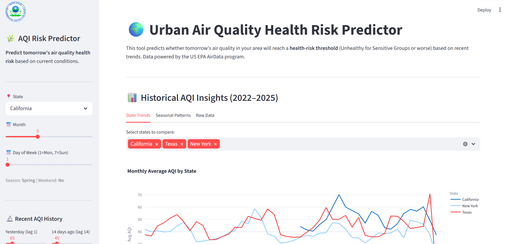
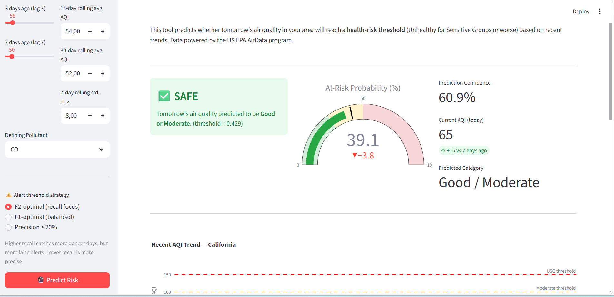
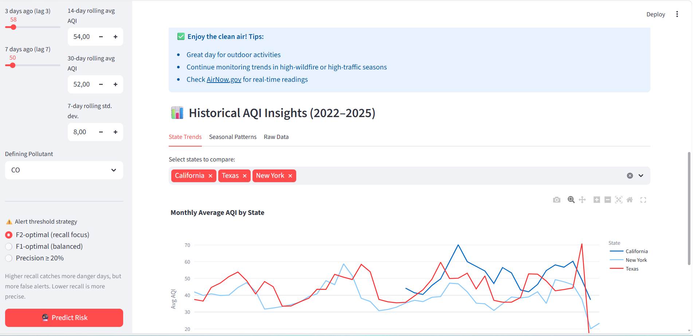

# 🌍 Urban Air Quality Health Risk Predictor

<p align="center">
  <a href="https://github.com/YOUR_USERNAME/Urban-Air-Quality-Health-Risk-Predictor">
    
  </a>
  <a href="https://github.com/YOUR_USERNAME/Urban-Air-Quality-Health-Risk-Predictor/blob/main/LICENSE">
    
  </a>
  <a href="https://streamlit.io">
    
  </a>
  <a href="https://www.python.org">
    
  </a>
  <a href="https://www.mysql.com">
    
  </a>
  <a href="https://xgboost.readthedocs.io">
    
  </a>
</p>

---

## ⚡ Overview

An end-to-end **data science portfolio project** that predicts daily air quality health risk categories for U.S. counties using EPA and OpenAQ data. The project combines data ingestion, MySQL warehousing, feature engineering, XGBoost modeling, and a polished Streamlit app built for public-health decision support.

The goal is to flag days where air quality may become dangerous, so users can act early instead of reacting late.

---

## 🎯 What Makes This Stand Out

- End-to-end pipeline from raw data to deployed dashboard.
- Public-domain EPA data plus free OpenAQ data for strong portfolio credibility.
- Class-imbalance aware modeling for rare but important at-risk days.
- Visually polished Streamlit app with trend charts, risk controls, and clear alert logic.
- Portfolio-ready documentation, badges, stats, and screenshots.

---

## 🧠 Problem Statement

Air pollution contributes to millions of premature deaths globally each year. Despite abundant monitoring data, most people cannot easily assess tomorrow’s air-quality risk.

This project builds a machine-learning classifier that predicts whether the next day will be **Safe** or **At-Risk** based on recent AQI patterns and rolling features. It is designed as a public-health style alerting tool, not just a generic prediction model.

---


## ✨ Project Highlights

- Predicts daily health risk categories for U.S. counties.
- Uses lag features and rolling aggregates to capture short-term air-quality dynamics.
- Trained with XGBoost for strong performance on tabular data.
- Evaluated with metrics that matter for rare-event prediction.
- Deployed in a Streamlit app with interactive risk controls.
- Supports repeatable ingestion, warehousing, and retraining.

---

## 📊 Model Performance

| Metric | Value | Interpretation |
|---|---:|---|
| ROC-AUC (CV) | 0.9894 | The model almost perfectly separates safe vs. at-risk days. |
| PR-AUC (validation) | 0.1940 | Strong for a dataset with only 1.1% positives. |
| Recall (At-Risk) | 0.50 | The model catches half of all truly dangerous days. |
| Precision | 0.1050 | About 1 in 10 alerts is correct, which is acceptable for alerting. |
| F2 Score | 0.2860 | Reflects a deliberate focus on recall over precision. |
| Accuracy | 0.9600 | High, but not the best measure for this imbalanced problem. |

### Why these metrics matter
Accuracy looks impressive, but it is misleading here because most days are safe. The real value is in recall, PR-AUC, and F2 score, which show how well the model handles rare dangerous days.

---

## 🧪 Model Interpretation

This model is optimized for **public-health alerting**, where missing a dangerous day is worse than raising a few extra alerts. The low positive rate makes the problem highly imbalanced, so metrics like ROC-AUC alone are not enough to judge usefulness.

The selected threshold favors recall, which makes the app more practical for early warnings. That tradeoff is intentional: the model is supposed to be cautious, not overly conservative.

---

## 🗂️ Project Structure

```text
Urban-Air-Quality-Health-Risk-Predictor/
├── app/                    # Streamlit web app
├── data/
│   ├── raw/                # Raw EPA/OpenAQ files
│   └── processed/         # Feature-engineered datasets
├── ingestion/             # Download, API fetch, loading scripts
├── models/                # Training scripts and saved model
├── notebooks/             # EDA and experimentation notebooks
├── sql/                   # Schema, seeds, and analysis queries
├── images/                # Screenshots for README and portfolio
├── requirements.txt       # Python dependencies
└── README.md              # Project overview
```

---

## 🧰 Tech Stack

| Layer | Tools |
|---|---|
| Language | Python 3.10+ |
| Database | MySQL 8.0 |
| Modeling | XGBoost |
| Data Processing | Pandas, NumPy, Scikit-learn |
| Visualization | Plotly, Seaborn, Matplotlib |
| App Framework | Streamlit |
| APIs / Data | EPA AirData, OpenAQ |
| Notebooks | Jupyter |

---

## 📚 Data Sources

| Source | Link | Type | License |
|---|---|---|---|
| EPA AirData 2024 | [daily_aqi_by_county_2024.zip](https://aqs.epa.gov/aqsweb/airdata/daily_aqi_by_county_2024.zip) | Bulk CSV | Public Domain |
| EPA AirData 2025 | [daily_aqi_by_county_2025.zip](https://aqs.epa.gov/aqsweb/airdata/daily_aqi_by_county_2025.zip) | Bulk CSV | Public Domain |
| OpenAQ API v3 | [api.openaq.org/v3](https://api.openaq.org/v3/) | Free API | CC BY 4.0 |

---

## 🚀 Live Features

- County-level air quality health risk prediction.
- Interactive feature sliders for lag and rolling-window inputs.
- Alert-threshold strategy selection.
- Monthly AQI trend visualization by state.
- Clean, professional dashboard layout suitable for portfolio review.

---

## 🛠️ How It Works

1. Raw EPA daily AQI data is downloaded.
2. OpenAQ data is fetched for supplementary recent observations.
3. Data is cleaned and stored in a MySQL star schema.
4. Lag and rolling features are engineered for prediction.
5. XGBoost is trained on historical data.
6. The model is evaluated with class-imbalance-aware metrics.
7. Streamlit presents risk predictions and trend charts interactively.

---

## 📈 Feature Engineering

Typical features used in the project include:
- Lag AQI values.
- Rolling averages over 7, 14, and 30 days.
- Rolling standard deviation.
- County and state identifiers.
- Pollutant context.
- Time-based features for trend capture.

These features help the model detect patterns that precede dangerous air-quality days.

---

## 🖥️ Screenshots

### Streamlit dashboard
<p align="center">
  
</p>

### Prediction view
<p align="center">
  
</p>

### Trend analysis
<p align="center">
  
</p>
---

## 🧪 Reproducibility

The project is set up to be easy to rerun and update:
- Download scripts refresh source data.
- SQL scripts rebuild the warehouse.
- Training scripts regenerate the model.
- The app reads the latest saved model and processed data.
- README badges and GitHub stats update automatically.

---

## 🚀 Quick Start

### 1. Clone the repo
```bash
git clone https://github.com/Toni8/Urban-Air-Quality-Health-Risk-Predictor.git
cd Urban-Air-Quality-Health-Risk-Predictor
```

### 2. Create virtual environment
```bash
python -m venv venv
venv\Scripts\activate
```

### 3. Install dependencies
```bash
pip install -r requirements.txt
```

### 4. Configure environment
```bash
copy .env.example .env
```

Edit `.env` with your MySQL credentials and any API keys.

### 5. Set up the database
```bash
mysql -u root -p < sql/create_schema.sql
mysql -u root -p < sql/populate_dim_date.sql
```

### 6. Ingest data
```bash
python ingestion/download_epa.py
python ingestion/fetch_openaq.py
python ingestion/load_to_mysql.py
```

### 7. Run analysis and train
```bash
jupyter notebook notebooks/01_EDA.ipynb
python models/train_model.py
```

### 8. Launch the app
```bash
streamlit run app/streamlit_app.py
```

---

## 📦 Setup Checklist

- Install Python 3.10+.
- Install MySQL 8 Community Edition.
- Install MySQL Workbench.
- Create a virtual environment.
- Install Python dependencies.
- Create `.env` securely.
- Build the database schema.
- Load source data.
- Train the model.
- Run the Streamlit app.
- Capture screenshots for the README.

---

## 🧭 Final Execution Checklist

| Step | Action | Why |
|---|---|---|
| 1 | Install MySQL 8 Community Edition | Required warehouse; free download |
| 2 | Install MySQL Workbench | GUI for schema and SQL runs |
| 3 | Create project folder and enter it | Keeps everything organized |
| 4 | Create and activate virtual environment | Isolates packages |
| 5 | Install requirements | Sets up dependencies |
| 6 | Create `.env` file | Keeps secrets out of code |
| 7 | Register for OpenAQ API key | Free API access |
| 8 | Register for EPA API key | Free EPA access |
| 9 | Create database and user | Sets up warehouse |
| 10 | Run `sql/create_schema.sql` | Creates tables and seeds dimensions |
| 11 | Run `sql/populate_dim_date.sql` | Fills the date dimension |
| 12 | Run `download_epa.py` | Downloads EPA CSVs |
| 13 | Run `fetch_openaq.py` | Fetches supplemental observations |
| 14 | Run `load_to_mysql.py` | Loads data into MySQL |
| 15 | Run analysis queries | Verify loaded data |
| 16 | Open the EDA notebook | Explore trends and distributions |
| 17 | Train the model | Generate final `.pkl` |
| 18 | Launch Streamlit app | View the dashboard |
| 19 | Test predictions | Confirm app behavior |
| 20 | Capture screenshots | Improve README presentation |
| 21 | Commit to git | Track versions |
| 22 | Push to GitHub | Publish portfolio repo |

---

## 🔒 Environment Variables

```bash
MYSQL_HOST=localhost
MYSQL_PORT=3306
MYSQL_USER=root
MYSQL_PASSWORD=your_password
MYSQL_DATABASE=air_quality_db
EPA_API_KEY=your_key_here
OPENAQ_API_KEY=your_key_here
```

---

## 📄 License

- EPA data is public domain.
- OpenAQ data is available under CC BY 4.0.
- Code in this repository is licensed under MIT.

---

## 👤 Author

**Sihle Kalolo**  
Johannesburg, Gauteng, South Africa

---

<p align="center">
  
</p>
